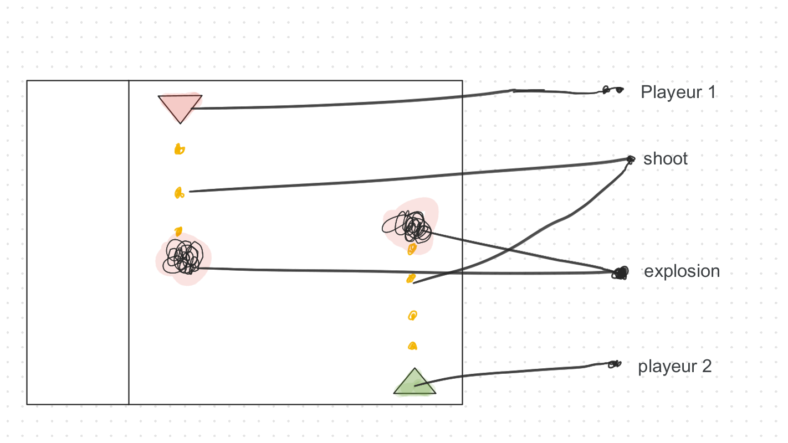

# Battle-Space
A project of game in one VS one, 

## fornt_end

### en tete
l'en tete se trouve dans un div        
il contien le titre du jeux puit un bouton demarer le jeux  (GAME)
     

### cadre du jeux
c'est un grand div qui contien tout le jeux        
il doit etre carré, et tout ce qui se trouve dedans doit avoir des  grandeur en %, pour fasilité la flexibilité  

### cases
des peti dive reparti 15 foix de gauche a droite et de 15 fois de haut zen bas  
ils n'ont pas de couleur et de cadre  
c'est eu qui vont contenir soit des vaiseau soit des micille soit rien  

### vaiseau playeur 1
un class construit sur le CSS qui donne un bacgrandeimage d'un vaiseau playeur 1 de preferance vert  
il est preferable qui l'image soit in png mais si non le fond doit etre en coileur blanc  
  
### explosion
un class construit sur le CSS qui donne un bacgrandeimage d'un esplision  
il est preferable qui l'image soit in png mais si non le fond doit etre en coileur blanc  

### micille
un class construit sur le CSS qui donne un bacgrandeimage d'un micille  
rectongulaire du sence haut bas  
il est preferable qui l'image soit in png mais si non le fond doit etre en coileur blanc  

### vaiseau playeu2
un class construit sur le CSS qui donne un bacgrandeimage d'un vaiseau playeu2 de diferante couleur que celle du playeu1  
il est preferable qui l'image soit in png mais si non le fond doit etre en coileur blanc  

## remarque
les image seron dans le dossier image  
c'est mieu si pour travailer dans le front end: om modifit la brance front-end et mais pas le main   
 	[savoit push sur une autre branche](https://www.theserverside.com/blog/Coffee-Talk-Java-News-Stories-and-Opinions/git-push-new-branch-remote-github-gitlab-upstream-example)  